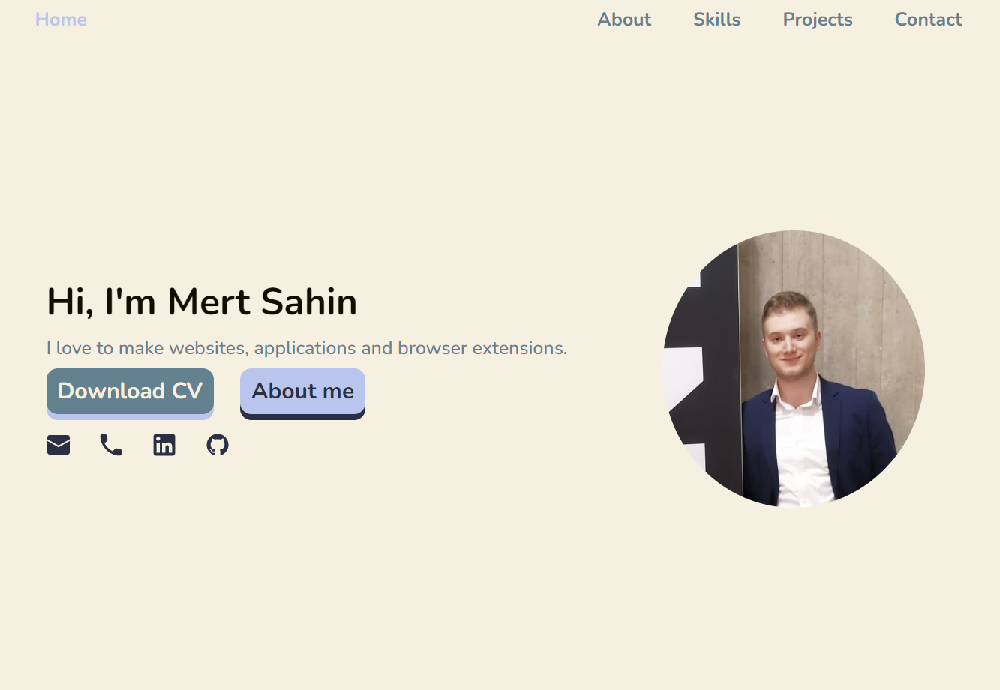
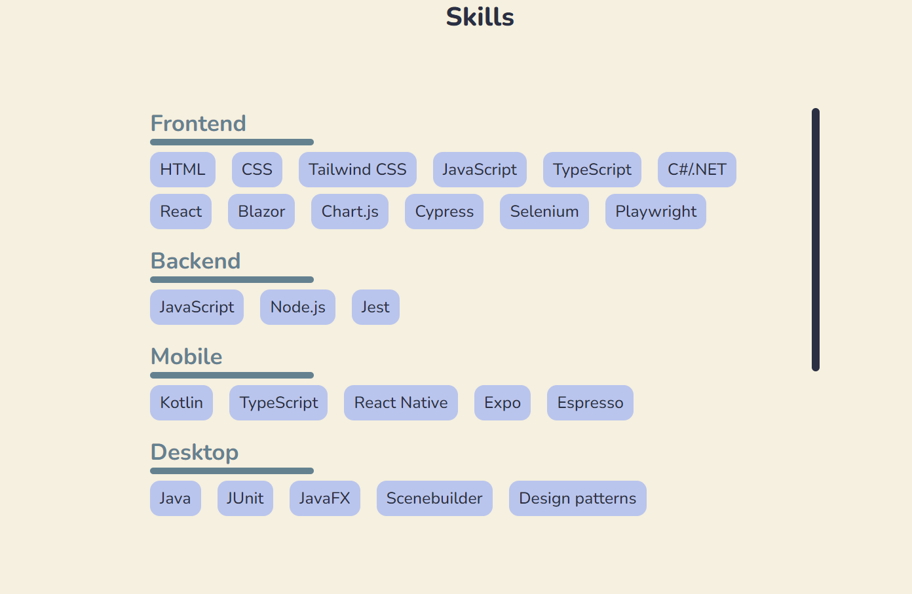
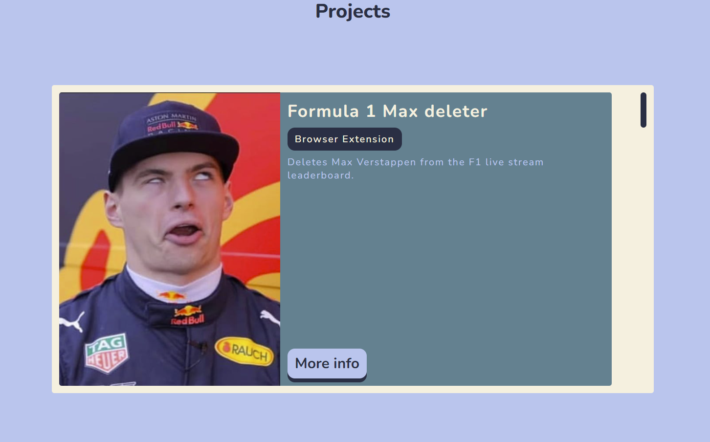
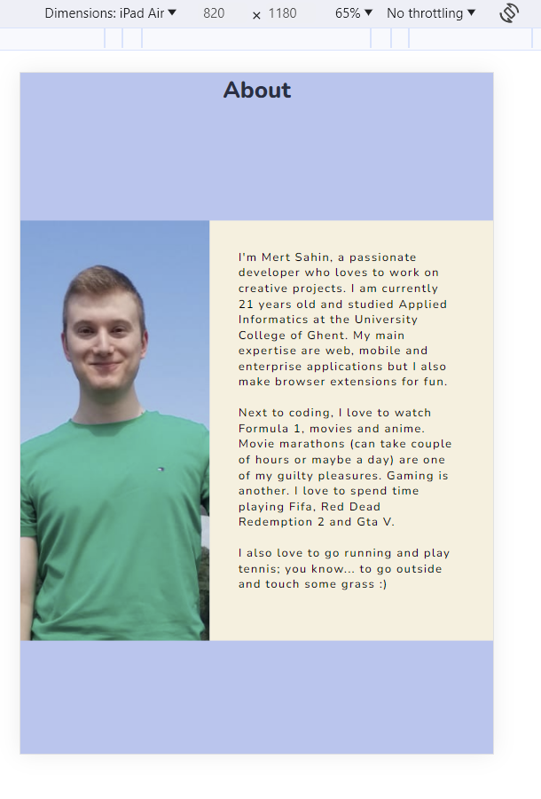
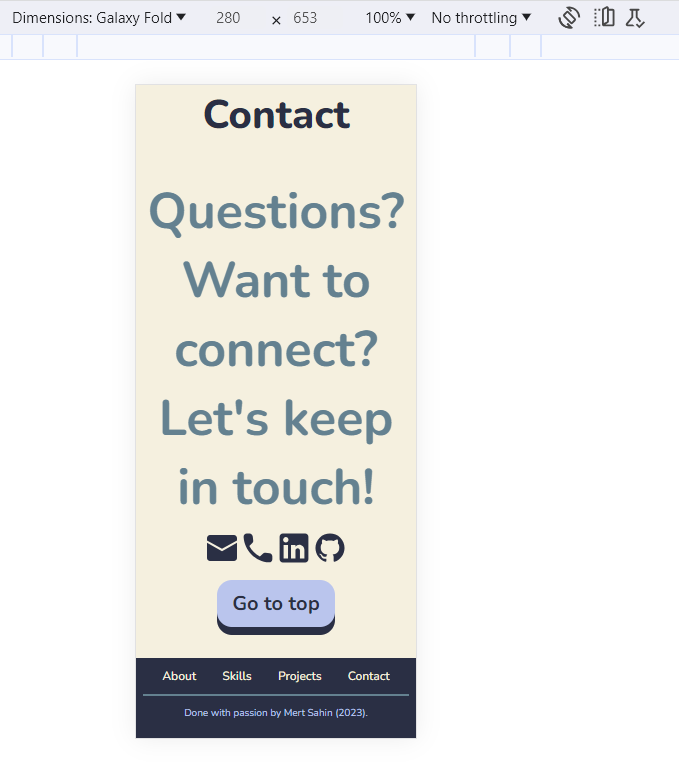

# portfolio

# Goal

Hello!

This is a project to display information about myself. The about section should give you an idea about me. The skills section should display my hard or technical skills. The projects section should give an overview of the projects I did (images, ...). The contact section should have my contact data. In the home section it should be possible to download my resume/cv.

# Tools

The website is done with HTML, CSS and JavaScript. Before coding I did the designs with Figma.

# Visual

### Desktop

### Ipad

### Phone

# Further improvements

Not really (maybe a contact form in the contact section).
